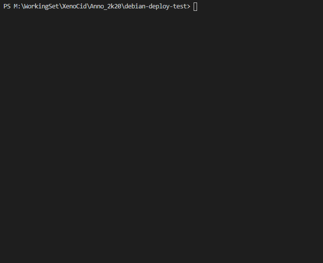

# debian-node-deploy



Here is a little module I made to simplify my deploy needs.

## How to use

Install locally

```bash
npm install debian-node-deploy
```

or

```bash
yarn add debian-node-deploy
```

create the config file on your app root : `deploy.config.json`.
Here is a sample file:

```json
{
  "envFile": ".env.production",
  "host": "my-production-server.org",
  "port": 22,
  "user": "myusername",
  "sshKey": "/path/to/ssh/key",
  "filesRestoryPath": "/where/to/send/the/archive/containing/the/code/to/deploy",
  "deployPath": "/where/to/deploy/the/app/on/production/server",
  "appPreStopCommands": [],
  "appPostStopCommands": [],
  "appPreStartCommands": [],
  "appPostStartCommands": []
}
```

The last four properties allow you to specify commands to execute before/after stopping the previous version in production and before/after starting the app.

### Usage

You can trigger a deploy from cli or from code.

### cli

Here is an example to add a deploy task to the scripts section of package.json.

```json
"scripts": {
   "deploy": "npm run build && deployNodeApp"
},
```

### js

```js
import deployNodeApp from "debian-node-deploy";

(async () => {
  await deployNodeApp();
})();
```
